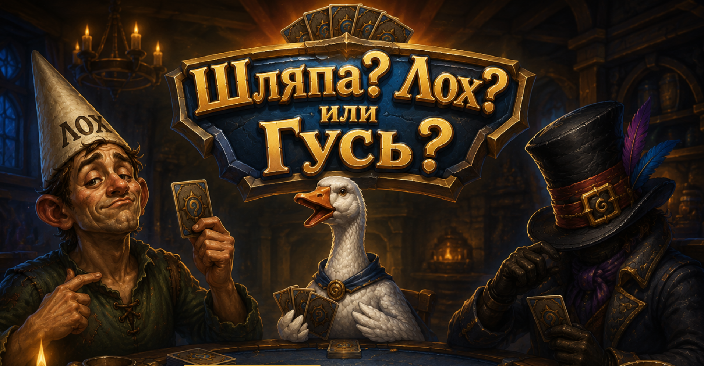

# Шляпа? Лох? или Гусь?

[](https://github.com/gremlintomsk/hat-fool-goose/actions/workflows/ci.yml)

**Играть онлайн: https://shlyapalohiligus.duckdns.org/**



Мини-игра на Three.js в стиле Hearthstone: три карты рубашкой вверх,
надо угадать, где спрятан загаданный персонаж (шляпа, лох или гусь).
Угадал — фейерверки и «ТЫ МОЛОДЕЦ!». Не угадал — затемнение и «ты ЛЛЛЛОХХ!».

## Режимы

- **Одиночная игра** — 10 попыток, серия умножает очки, рейтинг со входом
  через Google. Расклады генерирует сервер.
- **«Перебей меня»** — после партии можно бросить вызов ссылкой: друг сыграет
  ту же самую раздачу, сервер сравнит результаты.
- **Дуэль «Напёрсточник»** — живой матч по ссылке: один прячет персонажа,
  другой ищет, роли чередуются каждый раунд, серия умножает очки. Не сходил
  за отведённое время — сервер ходит за тебя.

Вся сетевая часть — короткие HTTP-запросы под `/api/` (дуэль — на
short-polling): реалтайм-каналов не требуется, работает за любым прокси.

## Локальный запуск

1. Создать `config.js` из примера:

   ```bash
   cp config.js.example config.js
   ```

   В `config.js` указывается публичный Google OAuth Client ID — он нужен только
   для входа через Google и таблицы рейтинга. Можно оставить заглушку из примера:
   игра будет работать, просто кнопка входа скроется. Как создать свой Client ID,
   написано в комментарии внутри `config.js.example`.

2. Собрать и запустить контейнер:

   ```bash
   docker build -t shlyapa-loh-gus .
   docker run --rm -p 8080:80 shlyapa-loh-gus
   ```

3. Открыть http://localhost:8080

Внутри контейнера nginx раздаёт статику и проксирует `/api/` на python-бэкенд
рейтинга (`api.py`). База рейтинга — sqlite в `/data/leaderboard.db`; чтобы она
переживала перезапуск контейнера, примонтируйте том:

```bash
docker run --rm -p 8080:80 -v slg-data:/data shlyapa-loh-gus
```

Three.js (0.164.1) лежит в `vendor/` — интернет контейнеру не нужен.

Арт (карты, рубашка, стол) — в `img/`: 1 шляпа, 2 гусь, 3 лох, 4 рубашка, 5 стол.
